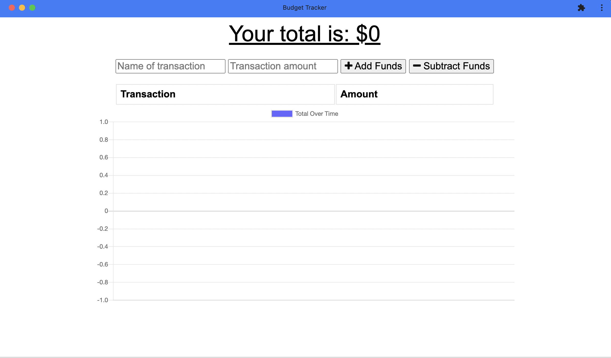

# budget-tracker2
Create a the budget tracker has a server and uses MongoDB as its database.

## User Story
AS AN avid traveler
I WANT to be able to track my withdrawals and deposits with or without a data/internet connection
SO THAT my account balance is accurate when I am traveling

## Acceptance Criteria
GIVEN a budget tracker without an internet connection
WHEN the user inputs an expense or deposit
THEN they will receive a notification that they have added an expense or deposit
WHEN the user reestablishes an internet connection
THEN the deposits or expenses added while they were offline are added to their transaction history and their totals are updated

    
## Built with 
* HTML
* JAVASCRIPT
* CSS
* NODE.JS
* EXPRESS.JS
* MONGO DB, MONGOOSE
* PWAs 
* Service worker, offline functionability, web manifest

## Website
https://whispering-reaches-85692.herokuapp.com/

## Contribution
Made with ❤️ by Maame (with assistance from class repository)

